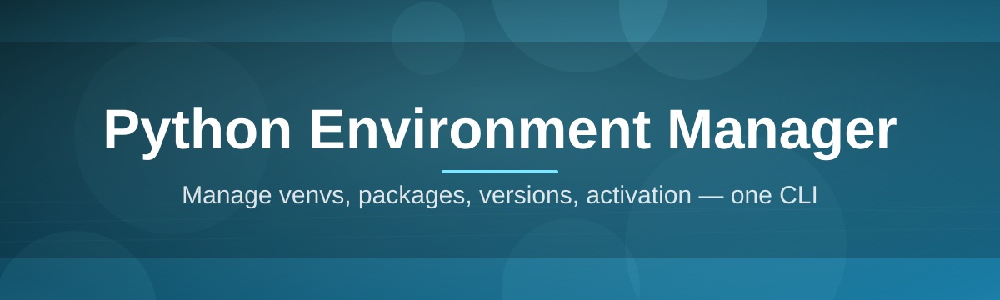

# python-environment-manager 🐍🧭

  

*One tidy control room for every Python interpreter, virtual environment, and dependency set on your machine.*

  

---

## 🤔 What This Is NOT

Let's clear the air before anything else.

This is **not** another CLI you have to memorize, not a wrapper that silently rewrites your PATH, and not a bloated IDE plugin that only works inside one editor. It doesn't touch your system Python installation, doesn't require a terminal degree, and it definitely isn't yet another package manager pretending to reinvent `pip`.

What it **actually is**: a lightweight, standalone desktop app for Windows that gives you a visual command center over every Python environment scattered across your drive — venvs, conda envs, pyenv installs, poetry projects, the works. Think of it as a air-traffic control tower for interpreters that quietly stopped talking to each other years ago.

## 🧩 Overview

Anyone who's worked with Python for more than a few months knows the quiet chaos that builds up: three versions of Python 3.x installed in different folders, a dozen `venv` directories nobody remembers creating, and a `requirements.txt` that lies about what's actually installed. The **Python Environment Manager** exists to bring order to that mess without asking you to change how you already work.

At its core, this tool scans your system, maps out every interpreter and environment it can find, and presents them in a single organized dashboard. From there you can inspect installed packages, compare dependency trees across environments, clone or archive a working setup, and clean up abandoned virtual environments that are quietly eating disk space. It's built for developers who juggle multiple projects — data scientists switching between conda environments, backend engineers maintaining several microservices with different dependency pins, and students who just want to know *which* Python is actually running when they hit F5.

This isn't a replacement for `venv`, `virtualenv`, `conda`, or `poetry` — it sits above them, as a translator and organizer. You keep using the tools you already trust; this just makes sure you can finally *see* what they've been doing behind your back.

  

---

## 📊 This vs. The Alternatives

> [!NOTE]
> Nobody wants to read ten paragraphs to figure out if a tool fits their workflow. Here's the honest breakdown.

| Capability | Python Environment Manager | Raw CLI (`venv`/`pip`) | IDE-Bundled Env Tools | Conda Navigator |
|---|---|---|---|---|
| Visual dashboard of all environments | ✅ Yes | ❌ No | ⚠️ Editor-locked | ✅ Yes |
| Works across venv, conda, pyenv, poetry | ✅ Unified view | ⚠️ Manual per-tool | ❌ Usually one ecosystem | ❌ Conda-only |
| Standalone, no dependencies to install | ✅ Yes | ✅ Yes | ❌ Needs the IDE | ❌ Needs Anaconda |
| Dependency conflict spotting | ✅ Built-in | ❌ Manual diffing | ⚠️ Limited | ⚠️ Limited |
| Orphaned environment cleanup | ✅ One click | ❌ Manual `rm` | ❌ Not offered | ⚠️ Partial |
| Portable, no admin rights required | ✅ Yes | ✅ Yes | ❌ Often needs install | ❌ Needs install |
| Learning curve | 🟢 Minutes | 🔴 Steep for beginners | 🟡 Moderate | 🟡 Moderate |

---

## 🔥 What Makes It Click

* **Environment cartography** — it draws a live map of every interpreter and virtual environment on your disk, so you stop guessing which `python.exe` a project actually uses.

* **Dependency X-ray vision** — peek inside any environment's installed packages, versions, and their transitive dependencies without activating a single shell.

* **Side-by-side diffing** — put two environments next to each other and instantly see what's missing, mismatched, or duplicated between them.

* **One-click environment cloning** — replicate a working setup into a fresh environment when you need to branch off a project without disturbing the original.

* **Orphan detection & cleanup** — surfaces virtual environments tied to projects you deleted months ago, so your SSD stops quietly filling up with ghosts.

* **Multi-backend awareness** — recognizes venv, virtualenv, conda, pyenv, and poetry-managed environments and displays them under one roof, no config files required.

* **Snapshot & restore** — freeze the exact state of an environment before a risky upgrade, and roll back in seconds if something breaks.

* **Zero footprint installation** — the entire app runs as a single portable executable; nothing gets written to your registry beyond what you explicitly approve.

> [!TIP]
> If you manage more than three Python projects at once, the side-by-side diff view alone will save you from at least one "why does this work on my machine" afternoon.

---

## 🚀 How To Get Started

1. **Visit the landing page** using the download button above or below — that's the only official source for the app.

2. **Download the latest build** for Windows 10/11 (x64). No installer wizard, no bundled toolbar offers.

3. **Run the executable.** Windows SmartScreen may show a prompt for unrecognized publishers — click "More info" → "Run anyway" if you trust the source.

4. **Let it scan.** On first launch, the tool indexes your drives for existing Python installs and environments. Grab a coffee if you have a lot of old projects lying around.

> [!IMPORTANT]
> Scanning is read-only by default. Nothing gets modified, deleted, or moved until you explicitly confirm an action inside the app.

---

## 🖥️ System Requirements

   

| Requirement | Detail |
|---|---|
| Operating System | Windows 10 (64-bit) or Windows 11 |
| Disk Space | ~120 MB for the app itself (excludes scanned environments) |
| RAM | 4 GB minimum, 8 GB recommended for large scans |
| Dependencies | None — fully self-contained executable |
| Admin Rights | Not required for standard use |
| Internet Connection | Only needed to check for updates |

---

## ⚙️ How It Works

The internal flow is intentionally simple — no daemons, no background services fighting for your CPU.

1. **Discovery** — the app walks common installation paths, registry hints, and PATH entries to locate Python interpreters and environment folders.

2. **Indexing** — each found environment gets fingerprinted: Python version, package list, creation date, and originating tool (venv, conda, etc.).

3. **Presentation** — everything renders into the dashboard as searchable, filterable cards and lists.

4. **Action layer** — you trigger operations (clone, diff, snapshot, delete) directly from the UI; the app translates that into the correct underlying commands for the environment's native tool.

5. **Verification** — after any action, the affected environment gets re-indexed automatically so the dashboard never shows stale data.

> [!NOTE]
> The app never invents its own environment format. It always defers to the native tool's conventions, so an environment it clones is just as usable from a plain terminal afterward.

---

## 🧯 Troubleshooting

<strong>The scan isn't finding one of my conda environments.</strong>

Make sure conda's base install path is discoverable — if you installed Miniconda or Anaconda to a custom, non-default directory, add that path manually under **Settings → Scan Paths** and re-run the scan.

<strong>Windows says the app is from an "unknown publisher."</strong>

That's expected for independently distributed tools without an expensive code-signing certificate. Verify you downloaded it from the official landing page linked in this README, then choose "Run anyway" if you're comfortable proceeding.

<strong>A package version shows differently than what `pip list` reports.</strong>

This usually means the environment was modified outside the app after the last scan. Hit the refresh icon on that environment's card to re-index it, and the numbers should sync up.

<strong>Can it manage Python installations themselves, not just environments?</strong>

It can display and organize installed interpreters, but it intentionally does not install or uninstall Python versions system-wide — that responsibility stays with official installers or version managers like pyenv.

<strong>My antivirus flagged the executable.</strong>

This happens occasionally with unsigned portable executables due to heuristic detection, not actual malicious behavior. Submit the file to your antivirus vendor for review if you'd like it whitelisted, and confirm you're using the version from the official landing page.

<strong>Cloning an environment is taking a long time.</strong>

Large environments with heavy scientific packages (NumPy, PyTorch, etc.) take longer to replicate because dependencies are reinstalled, not copied blindly. This preserves compatibility but does add wait time proportional to package size.

---

## 🎨 UI / UX Details

> [!TIP]
> Everything below is customizable under **Settings**, and most actions have a keyboard shortcut so you rarely need to touch the mouse once you're used to the layout.

**Themes** — Light, Dark, and a high-contrast mode for accessibility. Theme switches apply instantly without a restart.

**Keyboard shortcuts:**

| Action | Shortcut |
|---|---|
| Refresh full scan | `Ctrl + R` |
| Open environment diff view | `Ctrl + D` |
| Quick search environments | `Ctrl + F` |
| Snapshot current environment | `Ctrl + S` |
| Open settings | `Ctrl + ,` |
| Close active panel | `Esc` |

**Layout options** — switch between card view and dense table view depending on whether you manage 3 environments or 300.

**Notifications** — a small toast confirms every completed action (clone finished, cleanup done, snapshot saved) so you're never left guessing whether something actually ran.

---

## 🤝 Contributing & Community

This project grows because people who live inside dependency chaos every day keep sending feedback, bug reports, and ideas.

* Found a rough edge? Open an issue describing your environment setup and what went sideways.

* Have an idea for a feature? Discussions are open — pitch it, even half-formed.

* Want to help directly? Pull requests are welcome for bug